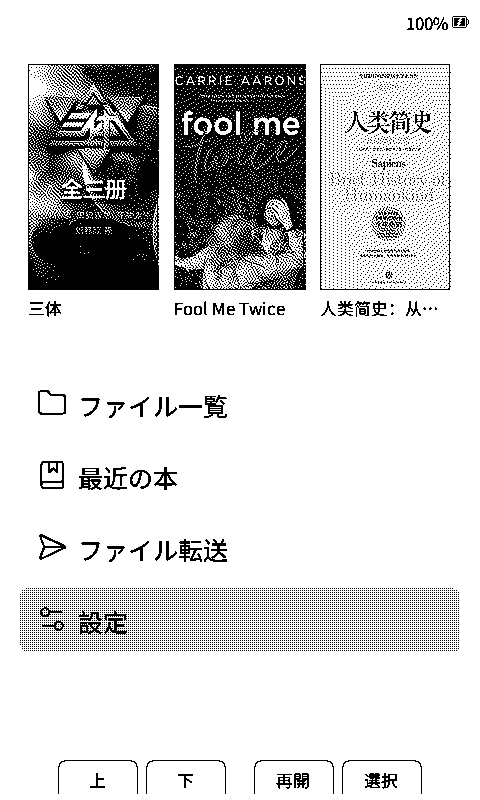
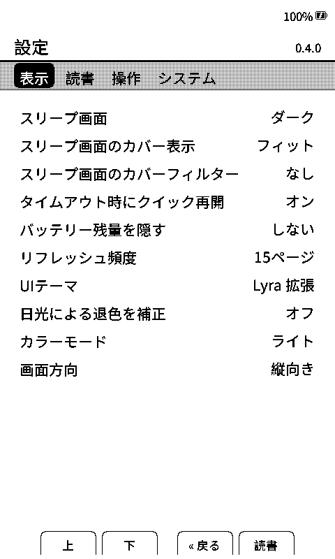
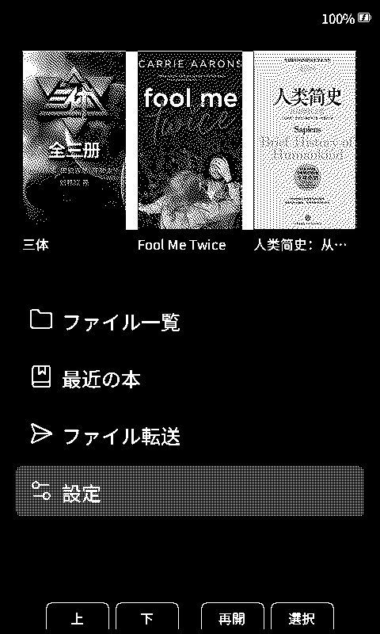
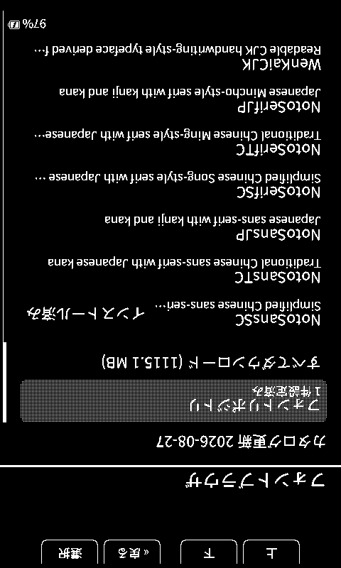
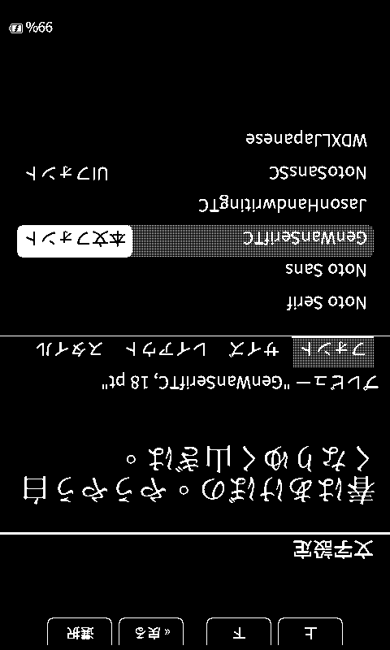

# CrossPoint Reader CJK

[English](./README.md) · [中文](./README-ZH.md) · **日本語**

**Xteink X4** 向けのコミュニティ製電子ペーパーリーダーファームウェアです。[CrossPoint Reader](https://github.com/crosspoint-reader/crosspoint-reader) をベースに、中国語や日本語を含む多言語環境で使いやすくなるよう改良しています。


## 主な機能

- 日本語、簡体字中国語、繁体字中国語、英語のユーザーインターフェース
- CJK の組版とフォント表示に対応した EPUB 2/3・TXT リーダー
- SD カードから読み込める本文フォントと UI フォント（`.cpfont` 形式）
- フォントのプレビュー、ダウンロード、インストールに対応した端末内カタログ
- 電子ペーパー向けに調整したライトモードとダークモード。ダークモードでは専用の再描画処理により、背景の白浮きを抑え、表紙画像も正しい階調で表示
- ホーム、設定、リーダー画面を含む UI 全体の上下反転
- ファイルブラウザ、表紙表示、スリープ画面、画面回転、読書位置の保存
- Wi-Fi 転送、WebDAV、OTA 更新、Calibre、KOReader Sync

## スクリーンショット

| ホーム・ライト | 設定・ライト | ホーム・ダーク |
|:--:|:--:|:--:|
|  |  |  |

| フォント一覧 | フォントプレビュー |
|:--:|:--:|
|  |  |

## インストール

### Web Flasher

1. Xteink X4 を USB-C で接続します。
2. [CrossPoint CJK Web Flasher](https://xteink-flasher-cjk.vercel.app/) を開きます。
3. **Flash CrossPoint CJK firmware** を選択します。

ファームウェアを手動で入手する場合は、[GitHub Releases](https://github.com/aBER0724/crosspoint-reader-cjk/releases) をご利用ください。

### ソースからビルド

PlatformIO Core、Python 3、サブモジュールを含むソース一式、Xteink X4 が必要です。

```sh
git clone --recursive https://github.com/aBER0724/crosspoint-reader-cjk.git
cd crosspoint-reader-cjk
pio run
pio run --target upload
```

## フォント

端末のフォントカタログから本文用・UI 用のフォントファミリーをインストールできます。フォントは SD カードに保存されます。

ファームウェア容量を抑えるため、内蔵フォントの文字セットは必要な文字を中心に絞っています。収録範囲外の珍しい漢字などは、欠落グリフとして表示される場合があります。より広い CJK 文字範囲が必要な場合は、**設定 > システム > フォント管理**から読書内容に合う **Noto Sans SC**、**Noto Sans TC**、または **Noto Sans JP** をインストールしてください。対応フォントを SD カードへ手動で配置することもできます。

- **[CrossPoint CJK Fonts](https://github.com/aBER0724/crosspoint-cjk-fonts)** — そのままインストールできる `.cpfont` フォントと再現可能なビルド環境
- **[CrossPoint CJK Font Maker](https://github.com/aBER0724/crosspoint-cjk-font-maker)** — 手持ちのフォントから対応パッケージを作成
- **[SD カードフォントガイド](./docs/sd-card-fonts-JA.md)** — 配置方法、フォントリポジトリ、技術仕様

## ドキュメント

- [ユーザーガイド](./USER_GUIDE-JA.md)
- [トラブルシューティング](./docs/troubleshooting-JA.md)
- [Web サーバーガイド](./docs/webserver-JA.md)
- [フォーク固有機能と上流マージ時の保護事項](./docs/fork-features-JA.md)
- [開発者向けドキュメント](./docs/contributing/README-JA.md)
- [プロジェクトの対象範囲](./SCOPE-JA.md)

## コントリビューション

開発環境と必要なチェックについては、[コントリビューターガイド](./docs/contributing/README-JA.md)を参照してください。

## 謝辞

- [CrossPoint Reader](https://github.com/crosspoint-reader/crosspoint-reader) — ベースとなったリーダーファームウェア
- [freeink-sdk](https://github.com/aBER0724/freeink-sdk) — ディスプレイおよびハードウェア SDK
- [CrossPoint CJK Fonts](https://github.com/aBER0724/crosspoint-cjk-fonts) — フォントカタログとビルド環境

CrossPoint Reader CJK は独立したコミュニティプロジェクトです。Xteink および X4 の製造元とは関係ありません。
