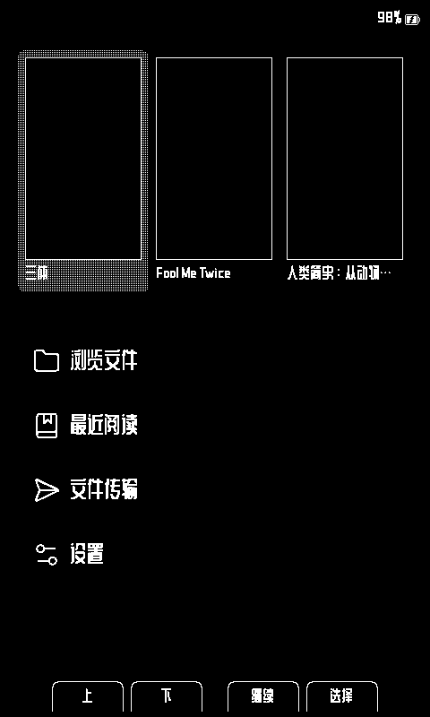

# CrossPoint Reader CJK

[English](./README.md) · **中文** · [日本語](./README-JA.md) · **版本 0.4.0**

面向 **Xteink X4** 墨水屏阅读器的社区固件。项目基于 [CrossPoint Reader](https://github.com/crosspoint-reader/crosspoint-reader)，重点改进中文、日文及多语言阅读体验。


## 主要功能

- 简体中文、繁体中文、日文和英文界面
- EPUB 2/3 与 TXT 阅读，支持 CJK 排版和字体渲染
- 基于 `.cpfont` 的 SD 卡阅读字体和 UI 字体
- 设备内字体目录：预览、下载、安装及自定义字体源
- 针对电子纸优化的浅色/深色主题与刷新策略
- 文件浏览、书籍封面、休眠画面、屏幕旋转和进度保存
- Wi-Fi 上传、WebDAV、OTA、Calibre 和 KOReader Sync



## 安装

### 网页刷写

1. 使用 USB-C 连接 Xteink X4。
2. 打开 [CrossPoint CJK 网页刷写器](https://xteink-flasher-cjk.vercel.app/)。
3. 选择 **Flash CrossPoint CJK firmware**。

也可以从 [GitHub Releases](https://github.com/aBER0724/crosspoint-reader-cjk/releases) 下载固件文件。

### 从源码构建

需要 PlatformIO Core、Python 3、包含子模块的完整仓库以及 Xteink X4。

```sh
git clone --recursive https://github.com/aBER0724/crosspoint-reader-cjk.git
cd crosspoint-reader-cjk
pio run
pio run --target upload
```

## 字体

CrossPoint Reader CJK 可以从设备字体目录安装完整的阅读字体和 UI 字体族。字体按需从 SD 卡加载，以控制固件体积和内存占用。

- **[CrossPoint CJK Fonts](https://github.com/aBER0724/crosspoint-cjk-fonts)** — 可直接安装的 `.cpfont` 字体目录及可复现构建流程
- **[CrossPoint CJK Font Maker](https://github.com/aBER0724/crosspoint-cjk-font-maker)** — 将自己的字体制作成兼容字体包
- **[SD 卡字体指南](./docs/sd-card-fonts.md)** — 安装目录、字体源与技术说明

## 文档

- [用户指南](./USER_GUIDE.md)
- [故障排查](./docs/troubleshooting.md)
- [Web 服务说明](./docs/webserver.md)
- [开发者文档](./docs/contributing/README.md)
- [项目范围](./SCOPE.md)

## 参与贡献

提交 PR 前请保持改动聚焦，并运行：

```sh
./bin/clang-format-fix
pio check --fail-on-defect low --fail-on-defect medium --fail-on-defect high
pio run
```

使用 AI 编码 Agent 时请同时阅读 [AGENTS.md](./AGENTS.md)。

## 致谢

- [CrossPoint Reader](https://github.com/crosspoint-reader/crosspoint-reader) — 上游阅读器固件
- [freeink-sdk](https://github.com/aBER0724/freeink-sdk) — 显示及硬件 SDK
- [CrossPoint CJK Fonts](https://github.com/aBER0724/crosspoint-cjk-fonts) — 字体目录和构建流程

CrossPoint Reader CJK 是独立的社区项目，与 Xteink 或 X4 硬件制造商无隶属关系。
