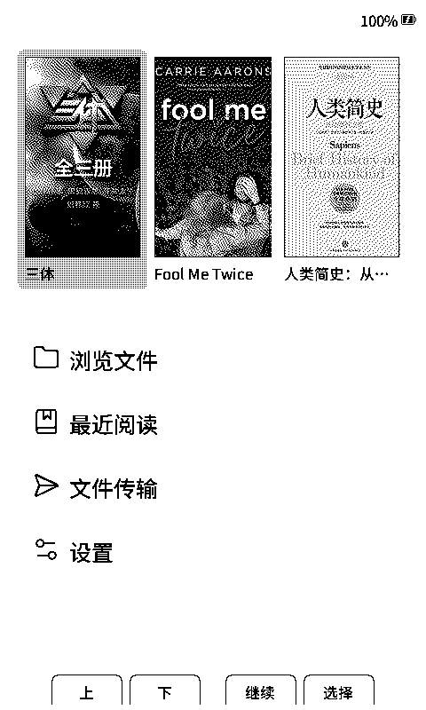
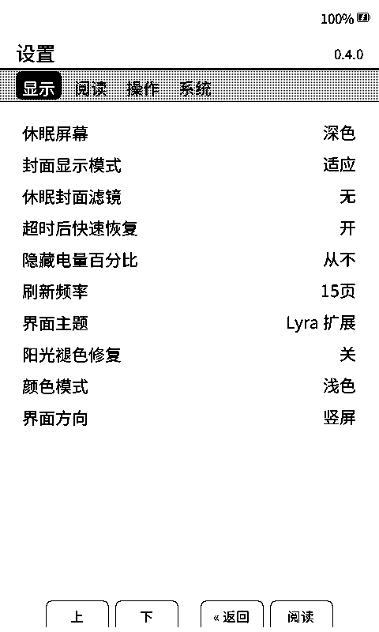
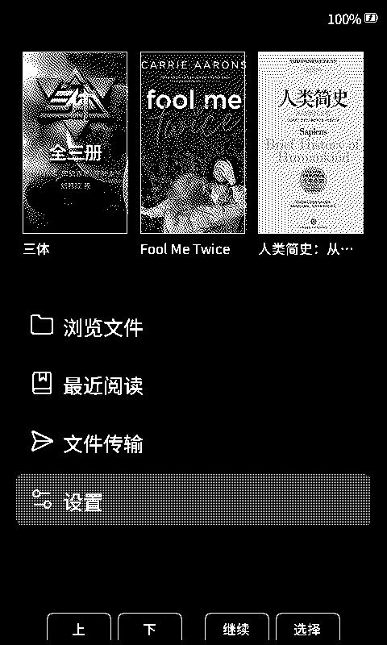

# CrossPoint Reader CJK

[English](./README.md) · **中文** · [日本語](./README-JA.md)

面向 **Xteink X4** 墨水屏阅读器的社区固件，基于 [CrossPoint Reader](https://github.com/crosspoint-reader/crosspoint-reader) 开发，补充了更实用的中文、日文和多语言阅读支持。


## 主要功能

- 简体中文、繁体中文、日文和英文界面
- EPUB 2/3 与 TXT 阅读，支持 CJK 排版和字体渲染
- 基于 `.cpfont` 的 SD 卡阅读字体和 UI 字体
- 设备端字体目录，可直接预览、下载和安装字体
- 针对电子纸优化的浅色和深色模式；深色模式使用专门的刷新策略，避免背景发白并保持封面图像正常显示
- 首页、设置页和阅读界面均支持 UI 上下倒置
- 文件浏览、书籍封面、休眠画面、屏幕旋转和阅读进度保存
- Wi-Fi 上传、WebDAV、OTA、Calibre 和 KOReader Sync

## 界面截图

| 主页 · 浅色 | 设置 · 浅色 | 主页 · 深色 |
|:--:|:--:|:--:|
|  |  |  |


## 安装

### 网页烧录

1. 使用 USB-C 连接 Xteink X4。
2. 打开 [CrossPoint CJK 网页烧录器](https://xteink-flasher-cjk.vercel.app/)。
3. 选择 **Flash CrossPoint CJK firmware**。

也可以从 [GitHub Releases](https://github.com/aBER0724/crosspoint-reader-cjk/releases) 下载固件文件。

### 从源码构建

需要 PlatformIO Core、Python 3、包含子模块的完整仓库以及 Xteink X4。

```sh
git clone --recursive https://github.com/aBER0724/crosspoint-reader-cjk.git
cd crosspoint-reader-cjk
pio run
pio run --target upload
```

## 字体

可从设备字体目录安装阅读字体和 UI 字体族，字体保存在 SD 卡中。

- **[CrossPoint CJK Fonts](https://github.com/aBER0724/crosspoint-cjk-fonts)** — 可直接安装的 `.cpfont` 字体目录及可复现构建流程
- **[CrossPoint CJK Font Maker](https://github.com/aBER0724/crosspoint-cjk-font-maker)** — 将自己的字体制作成兼容字体包
- **[SD 卡字体指南](./docs/sd-card-fonts-ZH.md)** — 安装目录、字体源与技术说明

## 文档

- [用户指南](./USER_GUIDE-ZH.md)
- [故障排查](./docs/troubleshooting-ZH.md)
- [Web 服务器指南](./docs/webserver-ZH.md)
- [二开功能与上游合并保护](./docs/fork-features-ZH.md)
- [开发者文档](./docs/contributing/README-ZH.md)
- [项目范围](./SCOPE-ZH.md)

## 参与贡献

开发环境和必需检查见[贡献指南](./docs/contributing/README-ZH.md)。

## 致谢

- [CrossPoint Reader](https://github.com/crosspoint-reader/crosspoint-reader) — 上游阅读器固件
- [freeink-sdk](https://github.com/aBER0724/freeink-sdk) — 显示及硬件 SDK
- [CrossPoint CJK Fonts](https://github.com/aBER0724/crosspoint-cjk-fonts) — 字体目录和构建流程

CrossPoint Reader CJK 是独立的社区项目，与 Xteink 或 X4 硬件制造商无隶属关系。
