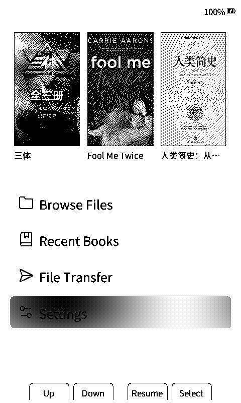
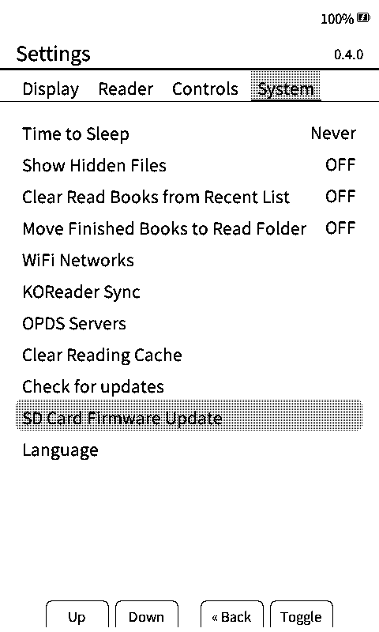

# CrossPoint Reader CJK

**Version 0.4.0** · [中文](./README-ZH.md) · [日本語](./README-JA.md)

Community firmware for the **Xteink X4** e-paper reader, based on [CrossPoint Reader](https://github.com/crosspoint-reader/crosspoint-reader) and adapted for Chinese, Japanese, and multilingual reading.


## Highlights

- Simplified Chinese, Traditional Chinese, Japanese, and English interfaces
- EPUB 2/3 and TXT reading with CJK-aware layout and typography
- SD-card reader and UI fonts using the `.cpfont` format
- On-device font catalog with preview, download, install, and custom repositories
- Light and dark themes with e-paper-optimized refresh behavior
- File browser, book covers, sleep screens, rotation, and reading progress
- Wi-Fi upload, WebDAV, OTA updates, Calibre integration, and KOReader Sync

## Screenshots

| Home | Settings |
|:--:|:--:|
|  |  |

Also available in [简体中文](./README-ZH.md#界面截图) and [日本語](./README-JA.md#スクリーンショット).

## Install

### Web flasher

1. Connect the Xteink X4 over USB-C.
2. Open the [CrossPoint CJK Web Flasher](https://xteink-flasher-cjk.vercel.app/).
3. Select **Flash CrossPoint CJK firmware**.

Releases and manual firmware files are available on the [GitHub Releases page](https://github.com/aBER0724/crosspoint-reader-cjk/releases).

### Build from source

Requirements: PlatformIO Core, Python 3, a recursive checkout, and an Xteink X4.

```sh
git clone --recursive https://github.com/aBER0724/crosspoint-reader-cjk.git
cd crosspoint-reader-cjk
pio run
pio run --target upload
```

## Fonts

CrossPoint Reader CJK can install complete reader and UI font families from the device's font catalog. Fonts are stored on the SD card and loaded on demand to keep firmware and memory usage manageable.

- **[CrossPoint CJK Fonts](https://github.com/aBER0724/crosspoint-cjk-fonts)** — reproducible catalog of ready-to-install `.cpfont` families
- **[CrossPoint CJK Font Maker](https://github.com/aBER0724/crosspoint-cjk-font-maker)** — create compatible font packages from your own fonts
- **[SD-card font guide](./docs/sd-card-fonts.md)** — installation layout, repositories, and technical details

## Documentation

- [User Guide](./USER_GUIDE.md)
- [Troubleshooting](./docs/troubleshooting.md)
- [Web server guide](./docs/webserver.md)
- [Developer documentation](./docs/contributing/README.md)
- [Project scope](./SCOPE.md)

## Contributing

Please keep changes focused and run the standard checks before opening a pull request:

```sh
./bin/clang-format-fix
pio check --fail-on-defect low --fail-on-defect medium --fail-on-defect high
pio run
```

See [AGENTS.md](./AGENTS.md) when working with an AI coding agent.

## Credits

- [CrossPoint Reader](https://github.com/crosspoint-reader/crosspoint-reader) — upstream reader firmware
- [freeink-sdk](https://github.com/aBER0724/freeink-sdk) — display and hardware SDK
- [CrossPoint CJK Fonts](https://github.com/aBER0724/crosspoint-cjk-fonts) — font catalog and build pipeline

CrossPoint Reader CJK is an independent community project and is not affiliated with Xteink or the X4 manufacturer.
